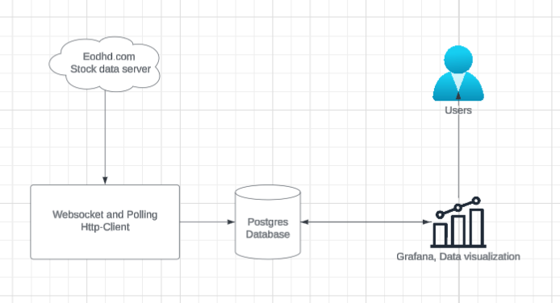
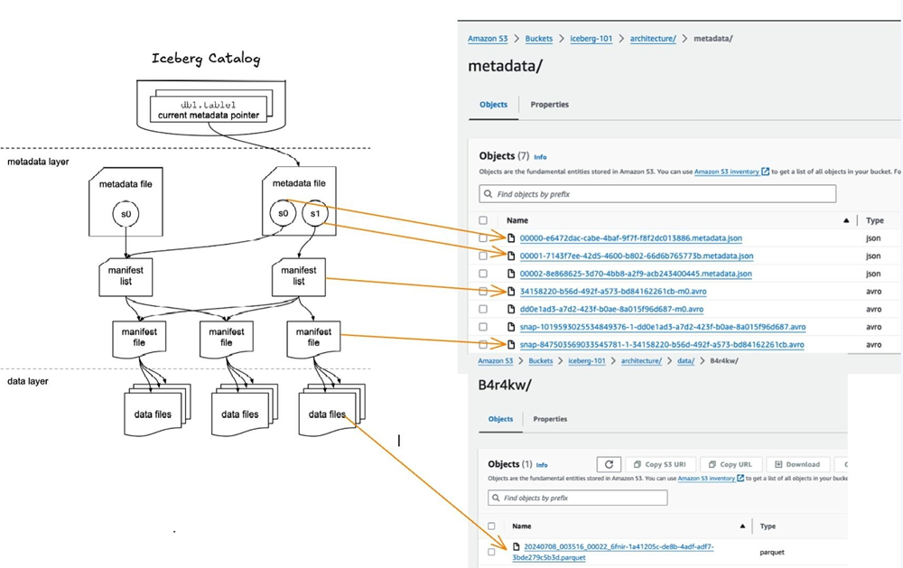
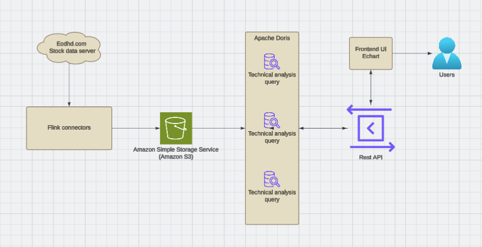

# Use iceberg storage layer for personal investment system

In 2024, I was trying to build my own quant investment analysis system. In this process, I was exposed to technologies related to large-scale data storage. In this article, I want to share one of them with you - that's Apache Iceberg.

### The old data pipeline design

The first version of the data pipeline of the analysis system look like below:

* **Data Source** — Eodhd.com provides live stock market data.
* **Ingestion Layer** — A axum (a Rust web framework) WebSocket and HTTP client consumes the data via streaming (WebSocket) and polling.
* **Storage** — Data is persisted in a PostgreSQL database.
* **Visualization** — Grafana queries the database to build real-time dashboards.

### The problems

The system is clean, straight forward and enough to run some simple query to build the strategy. However, there are two problems:

The first issue is that it is actually expansive to run a cloud verson postgresql. The cheapest option that I found is $25/month with 8GB disk size (the supabase PRO subscription)

The second problem is about grafana query ability. It is hard to build complex strategy only use grafana's query.

As you might notice, I am using Apache Iceberg to solve the first problem. But the reason I chose it, is not only because Iceberg stores data on object storage, but also with its other features. I will introduce them in this article.

### Describe Iceberg in one sentence

> iceberg is the data storage technology that adds row data query ability on the top of column based data formmat.

### Architecture of iceberg

Apache Iceberg consists 3 layers:

* Catalog layer
* Metadata layer

* Data layer

Catalog layer

The catalog layer stores a pointer to current metadata file for each table. It is the single source of truth for "where does this table live right now?" and handles ACID concurrency via optimistic locking.

Example catalog: Rest catalog, JDBC catalog, AWS Glue catalog, Hive Metastore etc. Espectially rest catalog, there are many opensource choice in different language.

Metadata layer

Instead of sorting tables into individual directories, Iceberg maintains a list of files. The metadata layer manages table snapshots, schema, and file statistics.

* **Manifest file:** It tracks individual data files and delete files. They also provide statistics, including column value ranges that help in query optimization by reducing the need to scan irrelevant files.
* **Manifest list:** A list of manifest files that make up a specific snapshot of an Iceberg table at a given point in time. It also summarizes data in manifest files like partition ranges and column statistics allowing query engines to determine which files are relevant.
* **Metadata file:** At the top are metadata files that keep track of the table state. It stores the table-wide information: schema, partitioning, and pointers to snapshots. Iceberg supports time travel via snapshots of the table in the past which can be accessed by the manifest list which points to manifest files representing an older version of the table

This tree structure lets compute engine skip irrelevant files without scanning the storage system.

Data layer

Data layer store the actual rows. Iceberg supports multiple file-format. Apache Parquet is most common for OLAP. It also support Apache ORC, Apache Avro which is good for streaming. The layer also stores delete files to handle data deletions without modifying original files.

The data can be stored in low-cost storage by using distributed file systems like Hadoop Distributed File System (HDFS) or cloud object storage solutions such as Amazon S3,

### Example paths with the three layers:

**Create a new Table**

* Create a metadata file
* Add a reference to the metadata file in the Catalog

**Insert data into the Table (bottom-up)**

* Create new data file
* Create a manifest file pointing to the data file
* Create manifest list that points to the manifest file
* Create a new metadata file with both old snapshot as well as a new snapshot of the table with the insertion of data that points to the manifest list
* Update the catalog reference to the latest metadata file. The catalog only gets updated if the transaction is successful.

**Query from a table (top-down)**

* Get the latest metadata file from the Catalog Layer
* Use the file statistics and locations to optimize query planning
* Retrieve only necessary files from the data layer for the query

Reads are top-down enabling efficiency and writes are bottom-up enabling reliability. Snapshots and Manifest Lists enable time travel to previous versions of the tables. And deletes are recorded in the metadata layer without rewriting data files ensuring consistency.

### Key Features of Apache Iceberg

#### ACID Transactions on Data Lakes

Iceberg provides robust ACID (Atomicity, Consistency, Isolation, Durability) transaction support to ensure data integrity and reliability in data lakes. This enables multiple independent applications to simultaneously access data in the data lake. When a writer commits a change, Iceberg creates a new, immutable version of the table’s data files and metadata.

### Full Schema Evolution

Schema changes (add, drop, rename, reordering, and type promotions) only change the metadata, without the need for data file rewrites or losing historical data.

### Hidden Partitioning

Iceberg handles the task of producing partition values for rows in a table ensuring that users don’t have to create or manage additional partitioning columns. Unlike before, users also don’t need to know how the table is partitioned and add extra filters to their queries. By storing partitioning information in the metadata layer versus physical folder structure, Iceberg decouples the logical partitioning scheme from the physical data layout. This allows for evolving partitioning schemes without data rewriting or restructuring. All of this enables better query performance and lower storage costs by minimizing redundant data in files.

### Time Travel and Rollback

Allows users to access historical data by querying previous versions of a table, based on snapshots or timestamps. Version rollback allows users to quickly correct problems by resetting tables to a good state.

### Expressive SQL support

Iceberg provides advanced SQL capabilities for querying large datasets with ease and efficiency. It handles complex data types, aggregations, filtering, and grouping effectively.

With Apache Iceberg + Apache Doris my data pipeline system becomes like this:

Programs have always essentially been a collection of how data is stored, transported, and computed. Even in today's era where everyone is talking about AI, technologies like Iceberg and Hudi, which deal with large-scale data storage, still play a very important role.
